# SHIntranet


> 팀 프로젝트 | MVC 패턴 기반 사내 인트라넷

---

## 📌 프로젝트 소개

**SHIntranet**은 회사 내부 직원만 접속할 수 있는 인트라넷 웹 시스템입니다.  
로그인 후 내 정보 조회·수정, 출퇴근 기록, 업무 지시·수신, 게시판, 전자 결재 등의 기능을 제공하며,  
인사부 전용 메뉴(직원·부서·직급 관리, 출퇴근 전체 조회)를 통해 권한별로 차등된 서비스를 제공합니다.  
수기·구두로 처리하던 인사 관리 업무를 웹 기반으로 전환하여 데이터 일관성과 업무 효율을 높이는 것을 목표로 하였습니다.

---

## 목차

1. [주요 기능](#주요-기능)
2. [기술 스택](#기술-스택)
3. [팀원 역할 분담](#팀원-역할-분담)
4. [내 담당 파트 (유현선)](#내-담당-파트-유현선)
5. [Oracle 주요 프로시저](#oracle-주요-프로시저)

---

## 주요 기능

- **로그인 / 로그아웃** — 사원코드 기반 세션 인증
- **마이페이지** — 개인 정보 조회 및 수정, 출퇴근 처리
- **출퇴근 관리** — 출근·퇴근 기록, 인사부 전용 전체 목록 조회
- **게시판** — 글 작성·수정·삭제, 파일 첨부, 댓글, 관리자 기능
- **업무 관리** — 업무 등록·목록·배정·수신·검색, 부서별 업무 관리
- **전자결재** — 결재 요청·제출·수신·상세 조회
- **조직 관리** — 사원 등록·수정·퇴직 처리, 부서 관리, 직급 관리
- **인사 문서** — 인사 문서 목록 조회 및 파일 다운로드

---

## 🛠 기술 스택

| 분류 | 사용 기술 |
|------|-----------|
| 서버 언어 | Java 21 |
| 웹 서버 | Apache Tomcat 10.1 |
| 화면 | JSP + JSTL 3.0 |
| DB | Oracle XE |
| DB 접근 | JDBC (ojdbc11) |
| 아키텍처 | MVC 패턴 (Servlet + DAO/DTO + JSP) |
| Frontend | HTML5, CSS3, JavaScript, jQuery |
| IDE | Eclipse |
| 형상 관리 | GitHub |

---

## 👥 팀원 역할 분담

| 팀원 | 담당 영역 | 주요 기능 |
|------|-----------|-----------|
| 유현선 | 인사 / 출퇴근 / 담당 업무 | 로그인, 직원·부서·직급 관리, 출퇴근 기록, 담당 업무 등록·조회 |
| 양호열 | 게시판 | 공지사항·일반 게시판 CRUD, 댓글, 첨부파일, 게시글·댓글 관리(인사팀) |
| 조세빈 | 문서 / 전자결재 | 문서 작성·결재라인 설정, 승인·반려 처리, 결재담당자 관리, 문서 관리(인사팀) |
| 정세찬 | 업무 | 회사·부서·사원 업무 등록, 업무 지시·수신, 일정 캘린더, 업무 관리(인사팀) |

---

## 👩‍💻 내 담당 파트 (유현선)

> 아래 6가지 기능은 팀 프로젝트 내에서 **유현선이 직접 설계·구현**한 파트입니다.

---

### ① 로그인

#### 개요
사원코드 기반 세션 인증 처리. 로그인 성공 시 세션에 직원 정보를 저장하고,
이후 모든 요청에서 세션 유무를 검증합니다.

#### URL 목록

| 메서드 | URL | 설명 |
|--------|-----|------|
| GET | `/login.do` | 로그인 폼 표시 |
| POST | `/login.do` | 로그인 처리 |

#### 주요 구현 포인트

- `EmpDAO.login()` → Oracle 프로시저 `EMP_LOGIN` 호출로 인증 처리
- 로그인 성공 시 `HttpSession`에 `loginEmp` 저장 → `/myinfo.do` 리다이렉트
- 모든 Servlet은 최초에 세션 유무를 확인하며, 세션 없으면 `/login.do`로 리다이렉트
- `myinfo.jsp` 로드 시 `loginEmp.deptName`이 `"인사부"`이면 인사 전용 메뉴를 추가 노출

```java
// 세션 체크 패턴 (각 Controller 공통)
EmpDTO loginEmp = (EmpDTO) session.getAttribute("loginEmp");
if (loginEmp == null) {
    response.sendRedirect(request.getContextPath() + "/login.do");
    return;
}
```

#### 분기 처리

```
로그인 성공 후
 ├─ deptName == "인사부"  →  인사 전용 메뉴 추가 노출 (myinfo.jsp 분기)
 └─ 그 외                →  일반 메뉴만 노출

세션 체크 (전 Servlet 공통)
 ├─ loginEmp != null  →  정상 진행
 └─ loginEmp == null  →  /login.do 리다이렉트
```

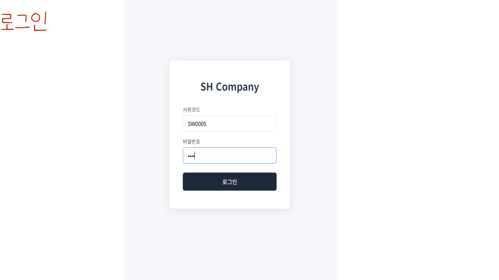

---

### ② 직원 관리 (인사부 전용 + 전 직원 검색)

#### 개요
사원 등록·수정·퇴사 처리를 담당합니다. Oracle 프로시저 기반으로 처리하며,
`VIEW_EMPLOYEE` 뷰를 통해 재직자만 조회합니다.

#### URL 목록

| 메서드 | URL | 설명 |
|--------|-----|------|
| GET | `/emp/list.do` | 직원 목록 |
| GET | `/emp/search.do` | 직원 검색 |
| GET | `/emp/insertForm.do` | 사원 등록 폼 |
| GET | `/emp/edit.do` | 사원 수정 폼 |
| POST | `/emp/insert.do` | 사원 등록 처리 |
| POST | `/emp/update.do` | 사원 수정 처리 |
| POST | `/emp/exitConfirm.do` | 퇴사 대상자 확인 (1단계) |
| POST | `/emp/exit.do` | 퇴사 처리 실행 (2단계) |
| GET | `/emp/api/list` | 직원 목록 JSON (타 기능 연계) |

#### 주요 구현 포인트

- **사원 등록**: `EMP_CREATE` 프로시저로 사원코드 자동 생성(`SW0001~`) 후 `EMP_INFO_CREATE`로 상세 정보(입사일 포함) 등록
- **사원 수정**: `EMP_UPDATE` + `EMP_INFO_UPDATE` 프로시저 연계 처리
- **퇴사 처리**: 1단계(사원코드 조회·검증) → 2단계(EMP_EXIT 실행) 2단계 구조로 처리. 상세 분기는 아래 참고
- `VIEW_EMPLOYEE`: `EMP + EMP_INFO INNER JOIN` 구성 → 퇴사자 자동 제외

#### 분기 처리

```
퇴사 처리 1단계 — 사원코드 조회
 ├─ VIEW_EMPLOYEE에 존재      →  재직 중, 정보 표시 후 2단계 진행
 ├─ 뷰에 없고 EMP에 있음     →  "이미 퇴사 처리된 사원"
 └─ EMP에도 없음             →  "존재하지 않는 사원코드"

퇴사 처리 2단계 — EMP_EXIT 실행
 ├─ EXIT_EMP_INFO에 이력 보관
 ├─ EMP_INFO 삭제
 └─ EMP 레코드 보존 (이력 유지)
```

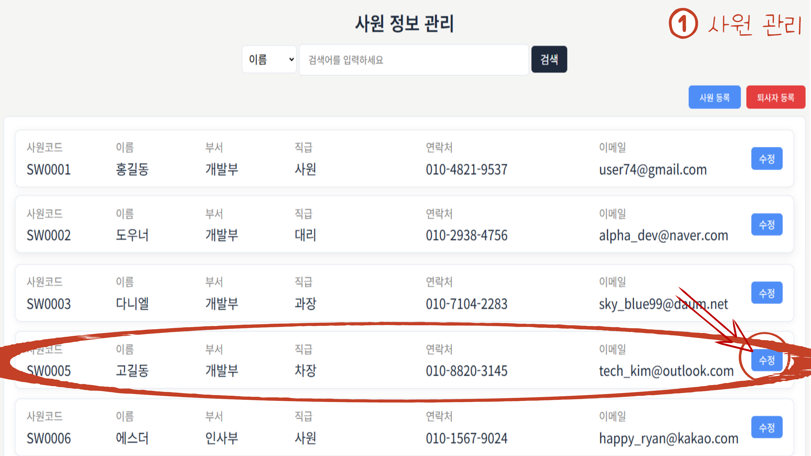
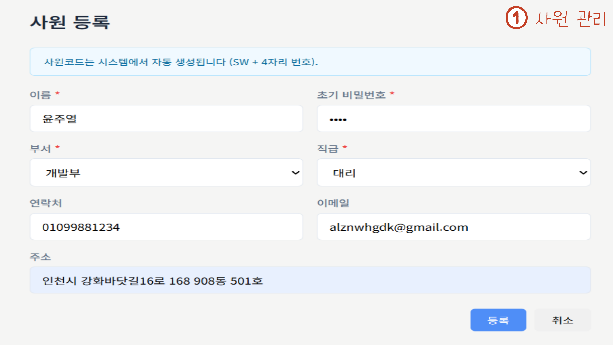
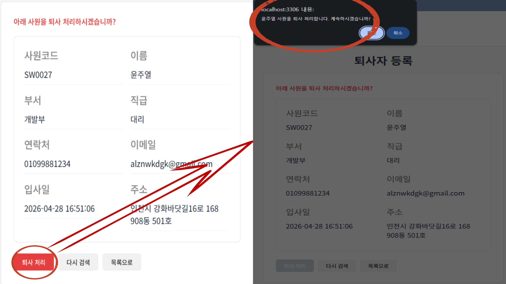

---

### ③ 부서 관리 (인사부 전용)

#### 개요
부서 등록·수정·삭제와 부서별 재직 인원 통계를 제공합니다.
모든 CUD 연산은 단일 프로시저로 처리하며 이력을 자동 저장합니다.

#### URL 목록

| 메서드 | URL | 설명 |
|--------|-----|------|
| GET | `/dept/list.do` | 부서 목록 |
| GET | `/dept/api/list` | 부서 목록 JSON |
| POST | `/dept/insert.do` | 부서 등록 |
| POST | `/dept/update.do` | 부서 수정 |
| POST | `/dept/delete.do` | 부서 삭제 |

#### 주요 구현 포인트

- 부서 목록에 `VIEW_EMPLOYEE LEFT JOIN`으로 소속 재직 인원 수 표시
- 상단 통계 카드: 전체 부서 수 / 사용 중인 부서 수 / 최근 추가 부서 수
- **유효성 검증**:

| 연산 | 검증 조건 |
|------|-----------|
| 등록 | 동일 부서명 등록 불가 |
| 수정 | 타 부서명과 중복 시 수정 불가 |
| 삭제 | 소속 재직 직원 존재 시 삭제 불가 |

- 모든 CUD → `DEPT_HISTORY_CUD` 프로시저 단일 호출로 처리 (이력 자동 저장)

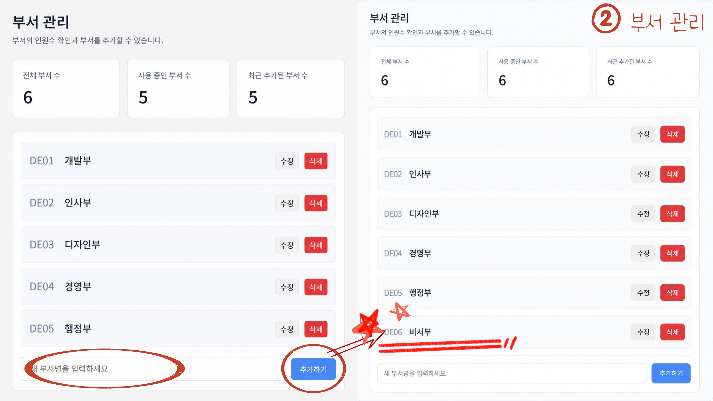

---

### ④ 직급 관리 (인사부 전용)

#### 개요
직급 등록·수정·삭제를 담당합니다.
직급에는 이름 외에 **Grade 등급 번호**가 있으며, 이는 업무 지시 대상자 필터링에 활용됩니다.

#### URL 목록

| 메서드 | URL | 설명 |
|--------|-----|------|
| GET | `/rank/list.do` | 직급 목록 |
| POST | `/rank/insert.do` | 직급 등록 |
| POST | `/rank/update.do` | 직급 수정 |
| POST | `/rank/delete.do` | 직급 삭제 |

#### 주요 구현 포인트

- Grade 숫자가 낮을수록 하위 직급이며, 업무 지시 시 대상자 필터 기준으로 사용

```
예) Grade=30인 직원이 지시하면 → Grade < 30인 직원에게만 지시 가능
```

- **유효성 검증**:

| 연산 | 검증 조건 |
|------|-----------|
| 등록 | 직급명·Grade 중복 시 각각 등록 불가 |
| 수정 | 타 직급과 Grade 중복 시 수정 불가 |
| 삭제 | 소속 재직 직원 존재 시 삭제 불가 |

- `POSITION_HISTORY_CUD` 프로시저로 이력 자동 저장

#### 분기 처리

```
직급 등록 시
 ├─ 동일 직급명 존재  →  오류 반환 ("직급명 중복")
 ├─ 동일 Grade 존재  →  오류 반환 ("Grade 중복")
 └─ 모두 통과        →  POSITION_HISTORY_CUD 실행

직급 수정 시
 ├─ 타 직급과 동일 Grade 존재  →  오류 반환
 └─ 통과                      →  POSITION_HISTORY_CUD 실행

직급 삭제 시
 ├─ 소속 재직 직원 존재  →  오류 반환
 └─ 없음               →  POSITION_HISTORY_CUD 실행
```

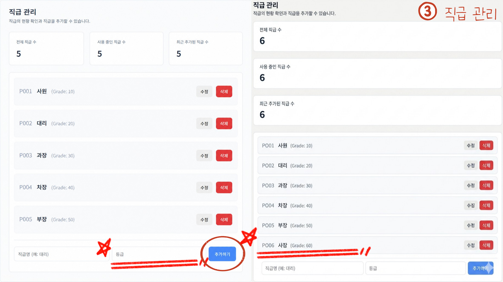

---

### ⑤ 출퇴근 관리

#### 개요
직원이 내 정보 화면에서 출근·퇴근을 기록합니다.
Java 레벨과 DB 레벨에서 이중으로 유효성을 검증하여 무결성을 보장합니다.

#### URL 목록

| 메서드 | URL | 설명 |
|--------|-----|------|
| POST | `/attend/in.do` | 출근 기록 |
| POST | `/attend/out.do` | 퇴근 기록 |
| GET | `/attend/list.do` | 전체 출퇴근 조회 (인사부 전용) |

#### 주요 구현 포인트

- `myinfo.jsp` 내 출근/퇴근 버튼 클릭 → POST 요청
- **유효성 이중화**:

```
Java 레벨: hasTodayIn() / hasTodayOut() 메서드로 중복·순서 위반 즉시 감지
           → 사용자에게 즉각 알림 (UX 향상)

DB 레벨  : ATTEND_IN / ATTEND_OUT 프로시저 내부에서 재차 검증
           → 무결성 보장 (API 직접 호출 등 우회 방어)
```

- 퇴근 조건: 오늘 출근 기록 있음 + 오늘 퇴근 기록 없음
- 인사부 전용 전체 조회: `VIEW_ATTEND_LOG` 뷰 (이름·부서·직급 조인), 이름·사원코드·부서·직급 검색 + 10개씩 페이징

#### 분기 처리

```
출근 버튼 클릭
 ├─ hasTodayIn() == false  →  ATTEND_IN 프로시저 실행
 └─ hasTodayIn() == true   →  "이미 출근 처리됨" (Java 레벨 1차 검증)

퇴근 버튼 클릭
 ├─ hasTodayIn() == true  &&  hasTodayOut() == false  →  ATTEND_OUT 실행
 ├─ hasTodayIn() == false                             →  "출근 기록 없음"
 └─ hasTodayOut() == true                             →  "이미 퇴근 처리됨"
```

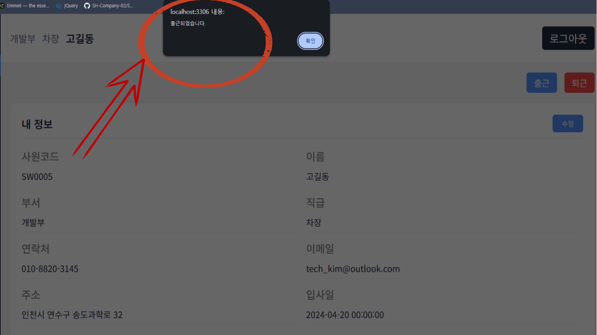
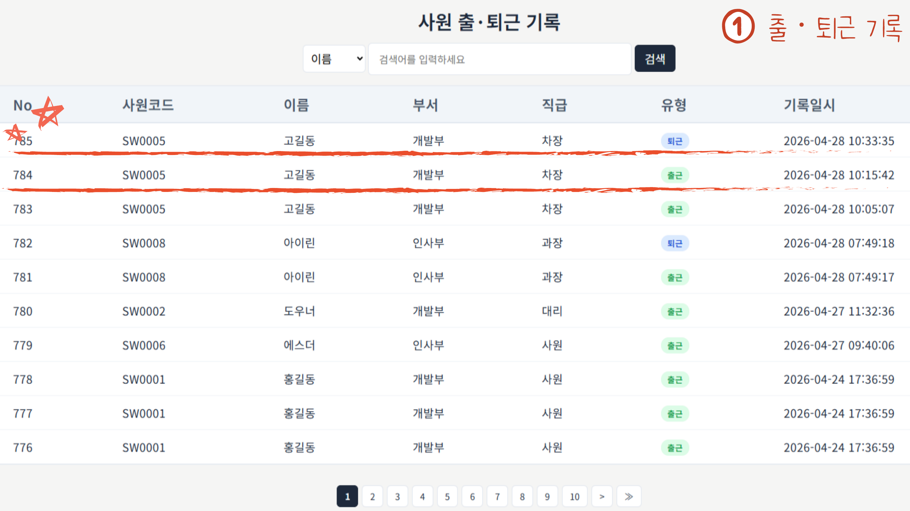

---

### ⑥ 담당 업무 등록·조회

#### 개요
회사 업무·부서 업무를 등록·조회합니다.
모든 응답은 JSON(AJAX 방식)으로 처리하여 화면 새로고침 없이 동작합니다.

#### URL 목록

| 메서드 | URL | 설명 |
|--------|-----|------|
| GET | `/worklist.do` | 업무 종류 JSON |
| GET | `/worksearch.do` | 회사 업무 검색 |
| GET | `/deptworksearch.do` | 부서 업무 검색 |
| POST | `/workadd.do` | 회사 업무 등록 |
| POST | `/deptworkadd.do` | 부서 업무 배정 |

#### 주요 구현 포인트

- 회사 업무: `WORK` 테이블 (코드 `WK0001~` 자동생성), 중복 등록 불가
- 부서 업무: `WORK_DEPT_RULE` 테이블 (FLOW 순서 포함) — 업무 지시 결재 라인 기반
- `VIEW_WORK_SEARCH` 뷰: 업무 + 등록자 부서·이름·직급을 한 번에 조회

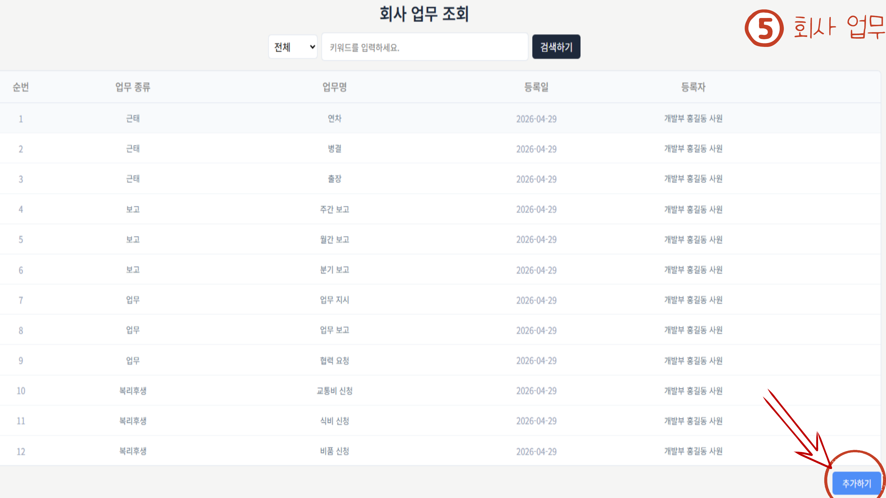
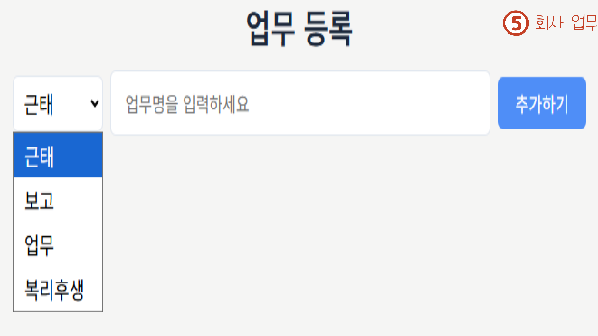
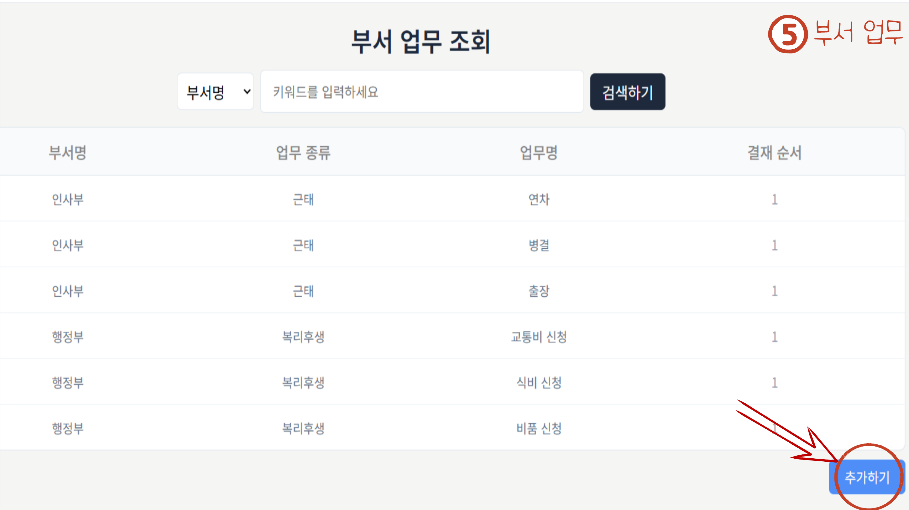
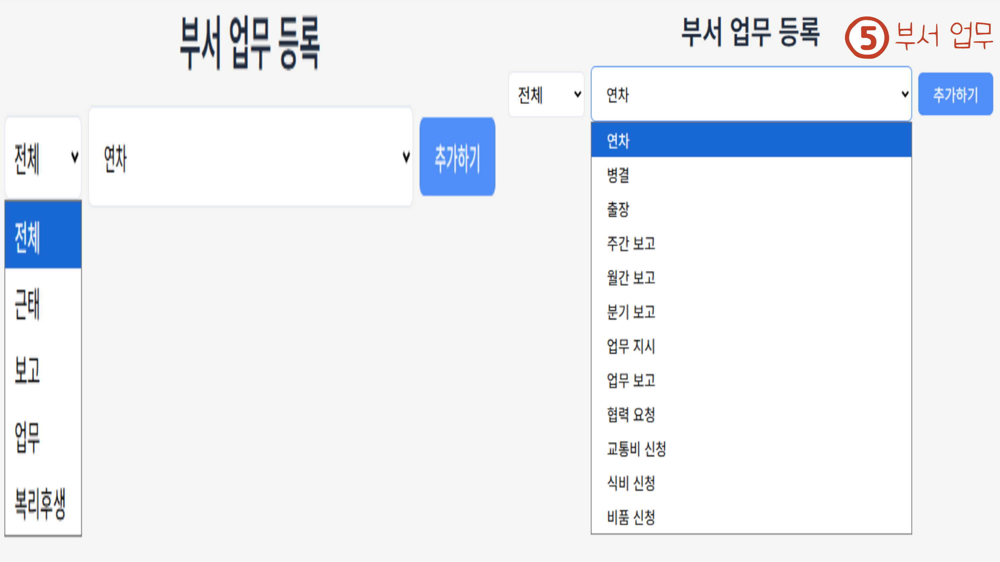

---

## 🗄 Oracle 주요 프로시저

| 프로시저 | 역할 |
|----------|------|
| `EMP_LOGIN` | 로그인 인증 처리 |
| `EMP_CREATE` | 사원 EMP 등록 (코드 자동생성) |
| `EMP_INFO_CREATE` | 사원 상세 정보 등록 (입사일 포함) |
| `EMP_UPDATE` | 사원 기본 정보 수정 |
| `EMP_INFO_UPDATE` | 사원 상세 정보 수정 |
| `EMP_EXIT` | 퇴사 처리 (EMP 보존, EMP_INFO 삭제, 이력 보관) |
| `ATTEND_IN` | 출근 기록 (중복 방지 포함) |
| `ATTEND_OUT` | 퇴근 기록 (중복 방지 포함) |
| `DEPT_HISTORY_CUD` | 부서 CUD + 이력 자동 저장 |
| `POSITION_HISTORY_CUD` | 직급 CUD + 이력 자동 저장 |
| `PRC_DOC_INSERT` | 업무 지시 문서 등록 |
